# 📊 UPI Transactions Data Analysis | Power BI

## 📌 Project Overview

This project presents an interactive **UPI Transactions Analytics Dashboard** developed in **Power BI** to analyze transaction trends, payment behavior, remaining balances, and financial activity across different cities and currencies.

The dashboard enables users to monitor monthly transaction trends, compare transaction amounts and remaining balances across cities and currencies, and explore the data using interactive filters, synchronized slicers, bookmarks, drill-down, and hierarchical analysis.

---

## 📷 Dashboard Overview

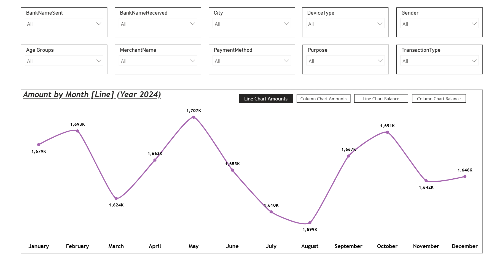

---

# 📂 Dataset

- **Source:** Excel Workbook
- **Total Records:** 20,000 UPI Transactions

---

# 🛠 Data Preparation (Power Query)

The dataset was cleaned and transformed using **Power Query Editor**.

### Transformations Performed

- Verified and corrected data types
- Converted **Account Number** to Text
- Extracted **Time** from the DateTime column
- Removed unnecessary columns
- Performed data profiling
  - Checked Column Quality
  - Checked Column Distribution
  - Verified null values
  - Ensured data consistency

### Screenshot

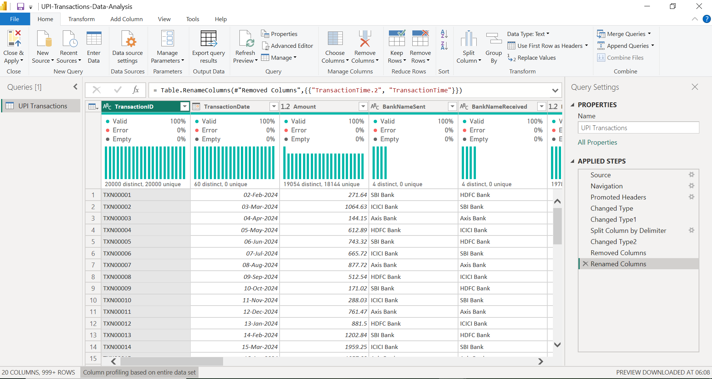

---

# 🧮 DAX

Created an **Age Group** calculated column using nested IF statements.

```DAX
Age Groups =
IF(
    'UPI Transactions'[CustomerAge] <= 25,
    "A1",
    IF(
        'UPI Transactions'[CustomerAge] <= 35,
        "A2",
        "A3"
    )
)
```

### Screenshot

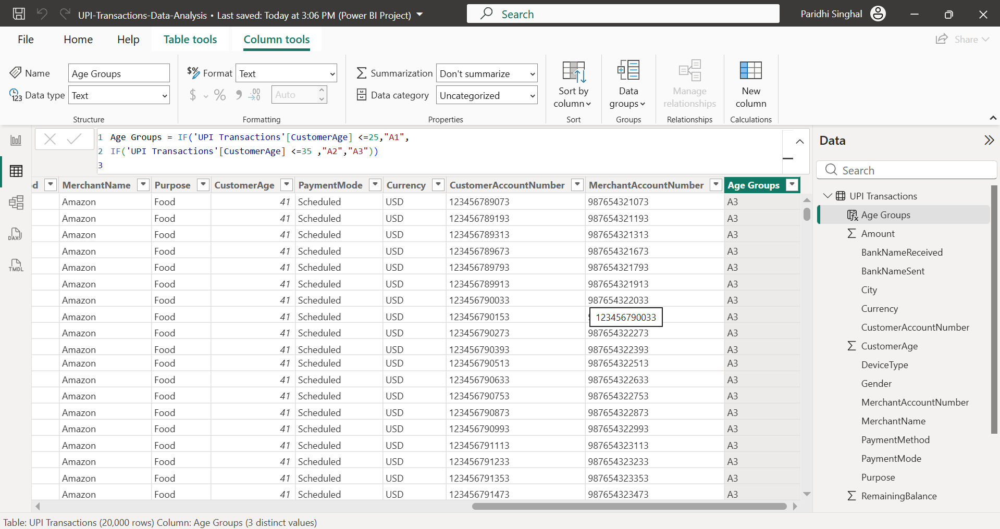

---

# 📈 Business Requirement 1

### Requirement

Analyze how transaction amounts change over time and evaluate transaction trends separately for each currency (INR, USD, EUR, GBP).

### Visualization Used

**Line Chart**

- Monthly transaction trend
- Currency applied as a report filter for individual trend analysis

### Sample Trend Analysis

#### INR

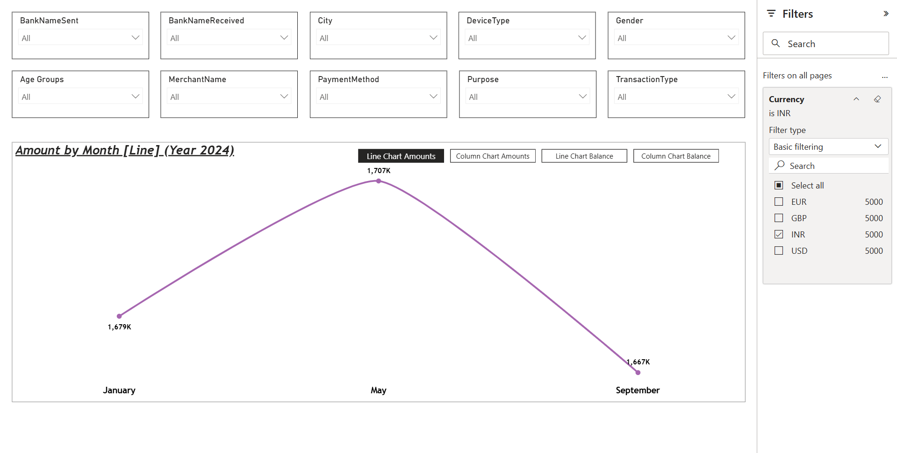

#### USD

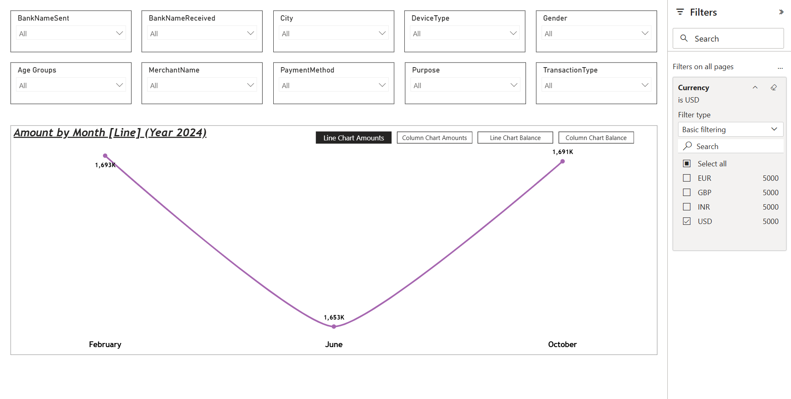

---

# 📊 Business Requirement 2

### Requirement

Analyze monthly transaction amounts and remaining account balances across different cities and currencies to identify regional transaction trends and compare financial activity over time.

### Visualization Used

**Matrix Visual**

Features included:

- City → Currency column hierarchy
- Drill Down
- Expand All Down One Level
- Conditional Formatting
- Comparative city analysis

### Screenshot

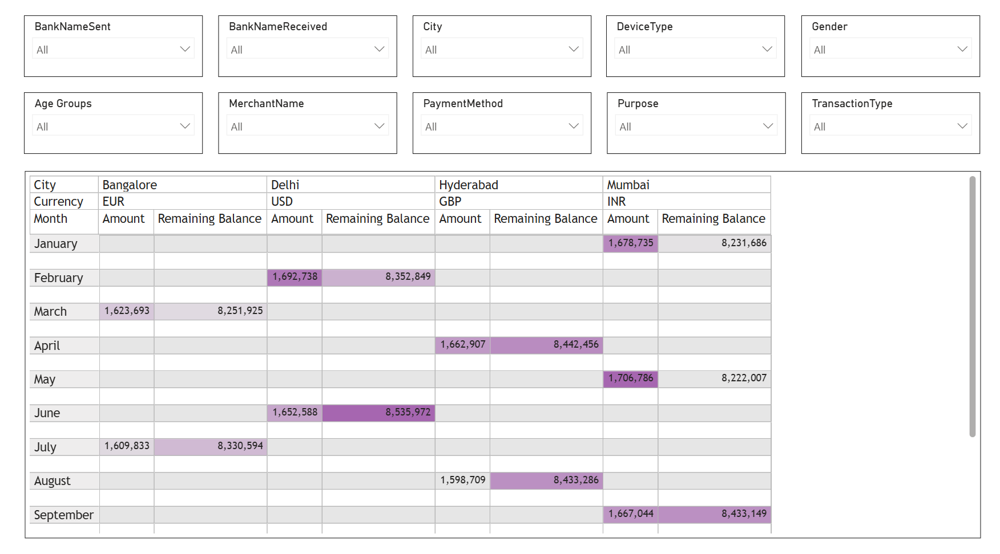

---

# 🎯 Interactive Dashboard Features

## Sync Slicers

Implemented synchronized slicers across both report pages to provide a consistent filtering experience.

### Available Filters

- Bank Name Sent
- Bank Name Received
- City
- Device Type
- Gender
- Age Groups
- Merchant Name
- Payment Method
- Purpose
- Transaction Type

### Screenshots

**Page 1**

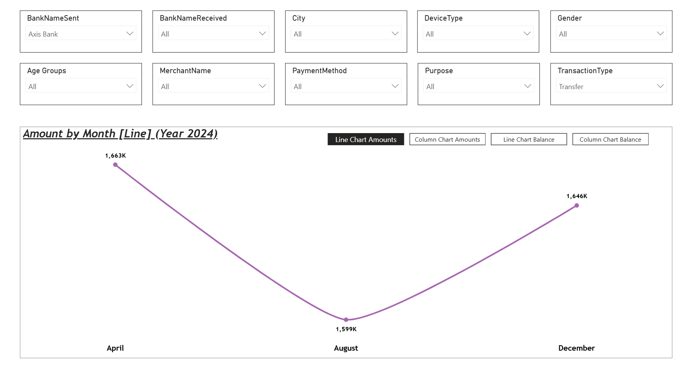

**Page 2**

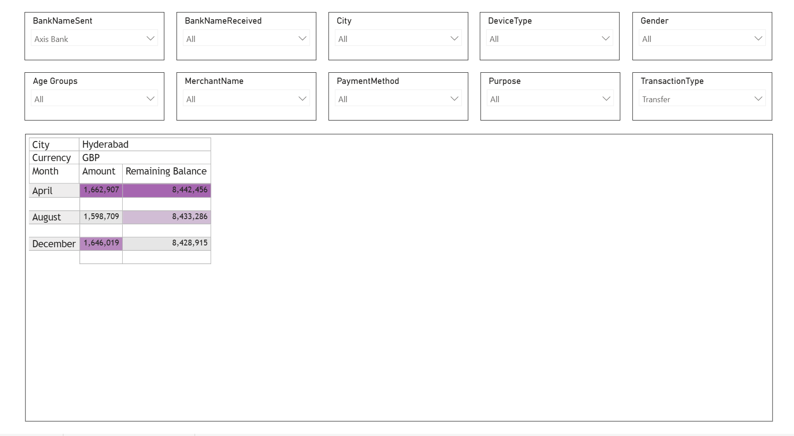

---

## Conditional Formatting

Applied conditional formatting in the Matrix visual to quickly highlight variations in:

- Transaction Amount
- Remaining Balance

---

## Bookmarks & Bookmark Navigator

Implemented bookmarks with a bookmark navigator, allowing users to switch between different visualizations without navigating to another report page.

Available views include:

- Transaction Amount – Line Chart
- Transaction Amount – Column Chart
- Remaining Balance – Line Chart
- Remaining Balance – Column Chart

### Screenshots

#### Transaction Amount (Line)


#### Transaction Amount (Column)

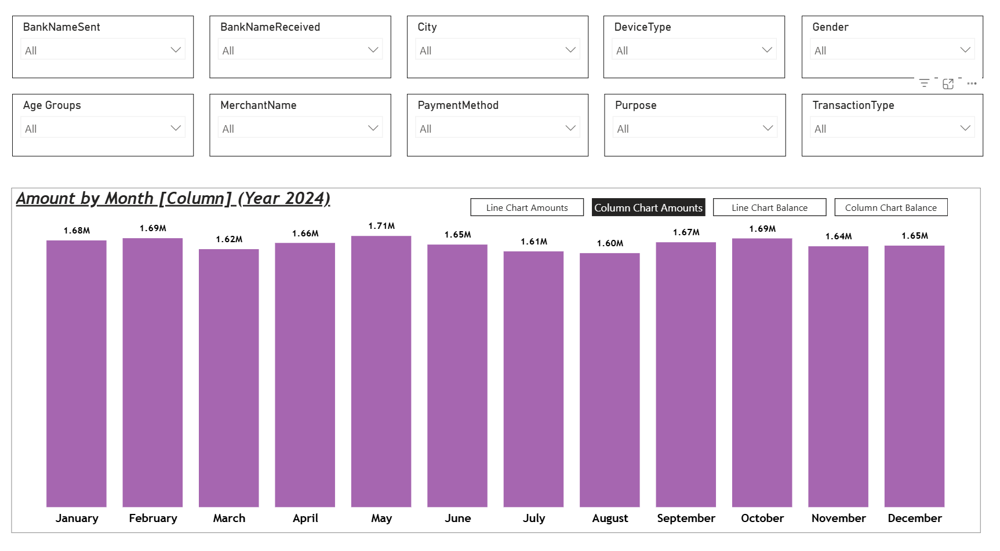

#### Remaining Balance (Line)

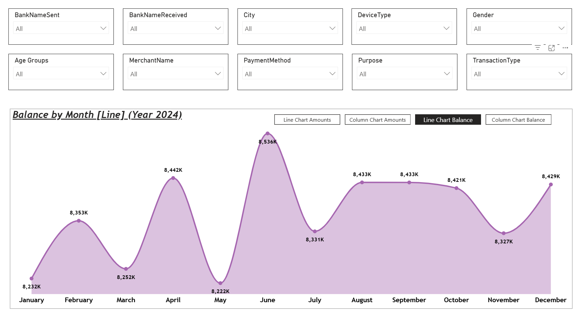

#### Remaining Balance (Column)

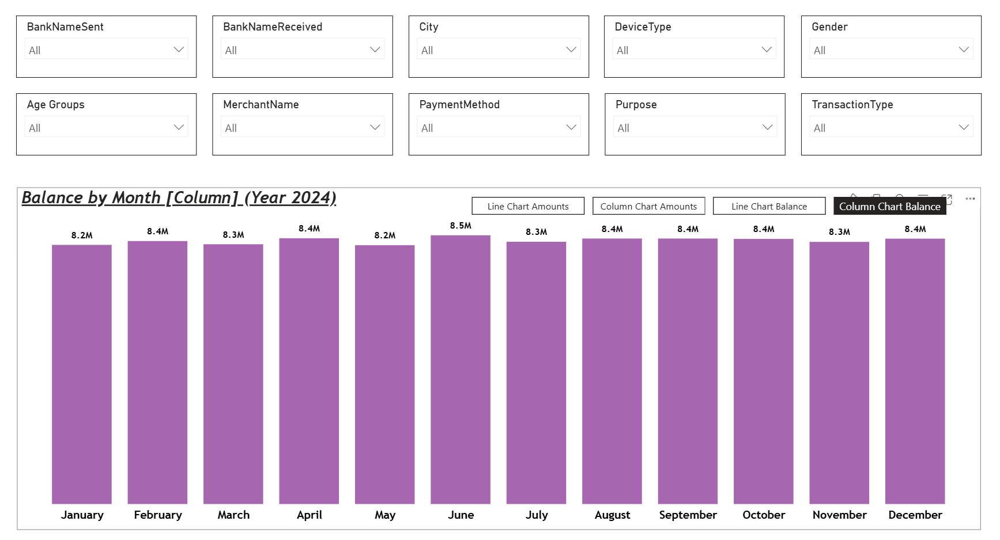

---

# 🚀 Power BI Skills Demonstrated

- Power Query (Data Transformation)
- Data Profiling
- DAX Calculated Columns
- Interactive Dashboards
- Time-Series Analysis
- Matrix Visualization
- Drill Down & Hierarchies
- Sync Slicers
- Conditional Formatting
- Bookmarks & Bookmark Navigator
- Power BI Service Deployment

---

# ☁ Deployment

The report was successfully published to **Microsoft Power BI Service**.

> **Note:** A live report link is unavailable because Power BI sharing requires a Power BI Pro or Premium license beyond the trial limitations.

### Screenshot

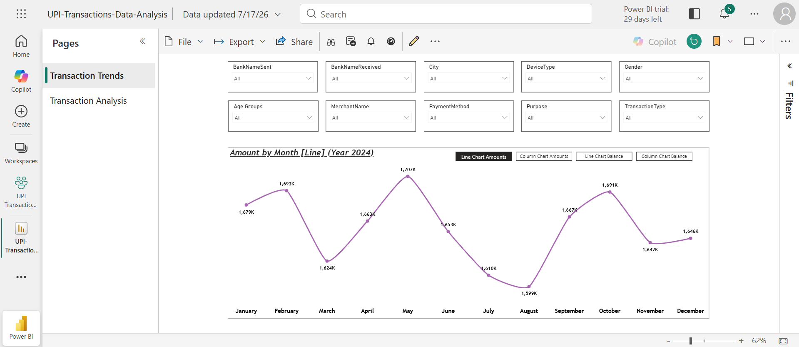

---

## 📁 Repository Structure

UPI-Transactions-Analytics-PowerBI/
│
├── README.md
│
├── dataset/
│   └── UPI Transactions.xlsx
│
├── PBIP_Project/
│   ├── PowerBI.pbip
│   ├── PowerBI.Report/
│   └── PowerBI.SemanticModel/
│
└── screenshots/
    ├── Project_Overview.png
    ├── PowerQuery_Transformations.png
    ├── DAX_Age_Groups.png
    ├── Transaction_Trend_INR.png
    ├── Transaction_Trend_USD.png
    ├── Matrix_City_Currency_Analysis.png
    ├── SyncSlicers_Page1.png
    ├── SyncSlicers_Page2.png
    ├── Bookmark_Amount_Line.png
    ├── Bookmark_Amount_Column.png
    ├── Bookmark_Balance_Line.png
    ├── Bookmark_Balance_Column.png
    └── PowerBI_Service.png

---

## 👩‍💻 Author

**Paridhi Singhal**

Aspiring Data Analyst | SQL | Power BI | Data Visualization

### Connect with Me

- [LinkedIn Profile](https://www.linkedin.com/in/paridhi-singhal123/)


---

